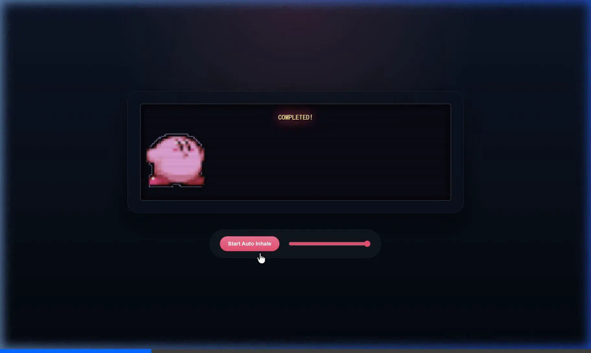

# 🌟 Kirby Progress Bar
>
> 一个星之卡比进度条组件。



你可以直接下载本项目并在浏览器打开 [minimal_demo.html](./minimal_demo.html) 查看最小工作示例。

---

## 🚀 快速上手 (Quick Start)

由于本组件完全基于标准的 Web Custom Elements (自定义标签) 构建，将其引入你的项目极其简单：

### 1. 引入组件脚本

在你项目的 `<head>` 或 `<body>` 末尾，引入核心的 JavaScript 文件。

```html
<script src="./path/to/kirby-progress.js"></script>
```

*(注意：请确保 `frames/` 动画序列帧文件夹与引用组件的环境路径匹配，或者通过 `asset-base` 属性指定路径)*

### 2. 在页面中直接使用标签

无需多余的 DIV 嵌套结构，直接在你想展示加载条的地方书写 `<kirby-progress>` 即可：

```html
<kirby-progress id="my-loader" value="15"></kirby-progress>
```

---

## ⚙️ API 文档 (API Reference)

该组件支持像原生 HTML 标签一样，通过修改 DOM 属性，或者通过 JavaScript 实例调用来完全掌控进度状态。

### ✅ 支持的属性 (Attributes)

可以直接写在 HTML 标签中，或使用 `loader.setAttribute('xxx', '...')` 修改：

| 属性名 | 类型 | 默认值 | 描述说明 |
| ----------- | ------- | ---------- | ------------------------------------------------------- |
| `value` | Number | `0` | 当前进度值，取值范围 `0-100`。组件会自动处理平滑移动的过渡动画 |
| `asset-base` | String | `./frames/` | 指向存放逐帧图片目录的基准路径。如果放在 CDN 或子级目录，需修改此项 |
| `autoplay` | Boolean | - | （可选）只要给标签打上此属性，便会自动触发模拟进度的吸入动画 |

### 🔧 实例方法 (Methods)

获取 DOM 节点后（例如 `const loader = document.getElementById('my-loader')`），可调用的控制方法：

- `loader.setValue(number)`：传入 0-100 的数值，精准设置当前进度。
- `loader.start()`：启动内置的自动加载动画，进度条会缓缓自动增加。
- `loader.stop()`：暂停内置的自动加载动画。
- `loader.reset()`：将进度条状态强行重置归零至 `0%`（即取消通关结算状态）。

### 📡 抛出事件 (Events)

可以通过 `loader.addEventListener(...)` 监听组件发出的生命周期事件：

- `progress`：当进度发生改变时抛出。`event.detail.value` 代表当前浮点数进度。
- `complete`：当进度值达到或冲破 `100` 时触发（进入通关霓虹闪烁状态）。`event.detail.value` 最终达成数值。
- `reset`：当进度条被执行了重置时触发。

---

## 💻 完整的交互代码示例

```html
<kirby-progress id="my-loader" value="0"></kirby-progress>

<script>
  const loader = document.getElementById("my-loader");

  // 【情景A】：模拟真实业务环境下的进度更新
  let currentLoaded = 0;
  function updateMyDownload() {
      currentLoaded += 10;
      loader.setValue(currentLoaded); // 通知卡比进度条更新位置
      
      if(currentLoaded < 100) {
          setTimeout(updateMyDownload, 500);
      }
  }
  
  // 启动您的业务下载任务
  updateMyDownload();

  // 【情景B】：监听进度条自己的动画播报并反馈给外部业务
  loader.addEventListener("complete", () => {
      console.log("游戏资源加载完毕，准备进入主画面！");
      // document.getElementById("game-canvas").style.display = "block";
  });
</script>
```
